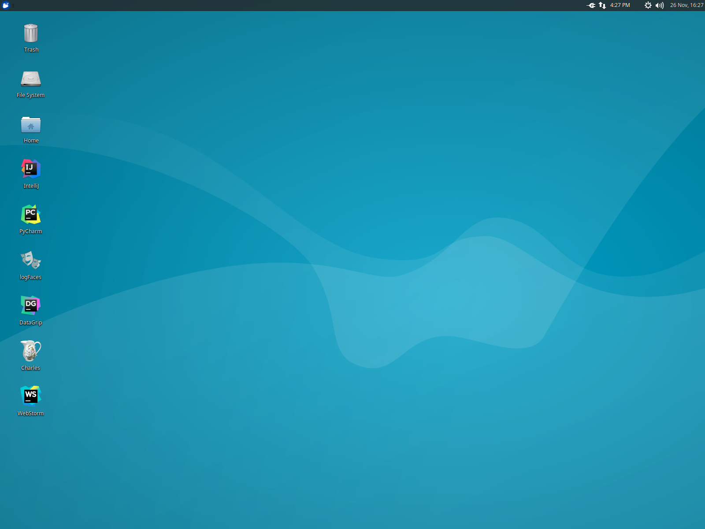

:toc:
:toc-placement!:

:note-caption: :information_source:
:tip-caption: :bulb:
:important-caption: :heavy_exclamation_mark:
:warning-caption: :warning:
:caution-caption: :fire:

= Software Development Environment
Ron Kurr <rkurr@jvmguy.com>

toc::[]

== Overview
This project is a Vagrant box that is provisioned for software development.  It is a Linux-based system and has many of the tools needed by a developer already installed.  The provisioning mechanism is based on Ansible and allows for user-specific customizations to be applied.

== Prerequisites

* https://www.vagrantup.com/[Vagrant] installed and working
* https://www.virtualbox.org/[VirtualBox] or https://www.vmware.com/products/fusion.html[VMware Fusion] installed and working
* https://en.wikipedia.org/wiki/X86_virtualization[Virtualization support] enabled in your BIOS
* a working internet connection
* Your corporate VPN running (if you want to apply some work-specific plays)

IMPORTANT: if you don't enable virtualization support in your BIOS, VirtualBox will not run correctly.


== Building
All the components of the environment live in repositories on the internet so there is nothing to build.

TIP: Some people have experienced issues when rebuilding a box due to flaky networks, online assets moving to different locations or installation processes changing.  When you need your box, you need your box and you don't have the time to troubleshoot an installation issue.  To combat this problem, we've decided to change the build model and bake in much of the software into the base image.  The trade-off we've made to ensure quick and stable rebuilds is a larger initial download.  All boxes are currently housed in https://app.vagrantup.com/kurron[HashiCorp's Vagrant Cloud] repository.

== Installation
Use Git to clone this project, go into the project folder,  type `vagrant up` and go get a cup of coffee.  The construction time of the box greatly depends on your internet speeds.

.Xubuntu


== Tips and Tricks

=== I Want To Customize My Box But I'm Not Comfortable With Ansible Yet
The articles https://opensource.com/article/18/3/manage-workstation-ansible[How to manage your workstation configuration with Ansible], https://opensource.com/article/18/3/manage-your-workstation-configuration-ansible-part-2[Manage your workstation with Ansible: Automating configuration] and https://opensource.com/article/18/5/manage-your-workstation-ansible-part-3[Manage your workstation with Ansible: Configure desktop settings] provide a nice recipe you can follow. The author suggests using `local.yml` as your playbook's name but our integration expects `playbook.yml`.  Other than that, you should be able to follow the recipe and customize the box to your liking.

=== Using Snap To Install Applications
Due to the ever increasing image size, some applications no longer come pre-installed.  Those applications, however, can be easily installed via Snap.  You can think of a Snap as a Docker image for GUI applications.  You can find the popular applications in the https://snapcraft.io/store[Snap Store]:

* MicroK8s
* Visual Studio Code
* Atom
* Skype
* Slack
* Chromium
* Firefox
* Brave
* Eclipse
* RubyMine
* PyCharm
* DataGrip
* PhpStorm
* IDEA
* GoLand
* GIMP

=== Upgrading
Sometimes the Vagrant file changes which can cause some subtle issues, such as creating an orphaned virtual machine. The safest upgrade procedure is the following:

1. `vagrant destroy` to remove the existing box
1. `git pull` to download the new files
1. **`vagrant box outdated`** to see if newer version of the box is available
1. `vagrant box update --box <boxname>` to pull down the current version of the box
1. `vagrant up` to build the new box

=== RAM and CPU Settings
If you examine the `vagrantfile` file, you will see that the virtual machine is configured to use 6GB of RAM and 2 CPUs.  Feel free to change these values to match your computer's hardware.

=== Low Disk Space
If an environment is used long enough, it is likely to run out of disk space.  The two main culprits are kernel updates filling up the `/boot` partition and Docker images filling up the `/var/lib/docker` partition.  You have at least 3 options:

* throw away the environment and start fresh
* clean up the old kernels via `sudo apt-get autoremove`
* clean up Docker containers via `docker rm --volumes --force $(docker ps --all --quiet)`
* clean up Docker images, after cleaning up the containers, via `docker rmi --force $(docker images --quiet)`

=== Verifying The Setup
Log into the system with a username of `vagrant` and password of `vagrant`.

=== Installed Infrastructure
Docker containers running common infrastructure are installed in `/home/vagrant/bin/servers`.  Look at the `docker-compose.yml` file to see what services are currently available to use.  Run the `start.sh` script to install and run the servers.  You can also start up a single server, eg `docker-compose up -d mongodb`.

=== Docker-based IDEs
We've deprecated the use of Docker-based IDEs.  We've found that projects that produce and consume Docker images can be challenging when running from within a container.  If Docker in Docker ever becomes mainstream, we'll look into switching back. See <<Using Snap To Install Applications>> for a better alternative.

=== Applying Your Company Specific Customizations
The system will look for an environment variable named `CORPORATE_PLAYS`.  If the shell running Vagrant specifies the variable such that it points to an Ansible project on GitHub, the plays will be run and the changes applied.  For example `export CORPORATE_PLAYS=kurron/ansible-pull-transparent.git` will result in https://github.com/kurron/ansible-pull-transparent.git[this playbook] getting run.  If the environment variable does not exist, the custom provisioning step is not run.

=== Applying Your Personal Customizations
The system will look for an environment variable named `USER_PLAYS`.  If the shell running Vagrant specifies the variable such that it points to an Ansible project on GitHub, the plays will be run and the changes applied.  For example `export USER_PLAYS=myaccount/my-custom-tweaks.git` will result in the playbook getting run.  If the environment variable does not exist, the custom provisioning step is not run.

=== Customizations: Linux Example
1. create and/or edit `~/.bash_profile`
1. add the two variables and save the file
1. open a new shell
1. `echo $CORPORATE_PLAYS` to verify the new variable has been properly set
1. `echo $USER_PLAYS` to verify the new variable has been properly set
1. you **may** have to log out and back in again for the variables to take affect

```
export CORPORATE_PLAYS=kurron/ansible-pull-transparent.git
export USER_PLAYS=foo/custom-tweaks.git
```

=== Customizations: Windows 10 Example
1. In Search, search for and then select: System (Control Panel)
1. Click the Advanced system settings link.
1. Click Environment Variables.
1. In `User variables for ...` add `CORPORATE_PLAYS` variable, pointing it to your plays on GitHub
1. In `User variables for ...` add `USER_PLAYS` variable, pointing it to your plays on GitHub
1. In Search, search for and then select: Command (Command Prompt)
1. `echo %CORPORATE_PLAYS%` to verify that your new variable has been properly set
1. `echo %USER_PLAYS%` to verify that your new variable has been properly set

=== Gather Docker Container Metrics
`sudo csysdig -pcontainer` will fire up the sysdig tool.  Use `F2` to switch to the container view and see how each container is using system resources.  Explore some http://www.sysdig.org/wiki/sysdig-examples/[examples of how to use Sysdig] and see how can aid in troubleshooting.

=== Sub-Projects
TIP: We've moved away from using `ansible-pull` and to using http://docs.ansible.com/ansible/playbooks_roles.html[Ansible Roles], which give us a better mechanism for reusing provisioning logic.  You can find a https://galaxy.ansible.com/kurron/[list of available roles] in my Ansible Galaxy account.  More are sure to be included over time.

=== Installed Software (partial list)

* current http://zulu.org/[JDK]
* http://sdkman.io/[SDKMAN!] to manage various JVM tools, including Groovy, Kotlin, Scala, Clojure, Java, VisualVM, Vert.x, Grails, Gradle, sbt, Maven, Ant and Leiningen
* https://nodejs.org/en/[NodeJS] and https://www.npmjs.com/[npm]
* https://packer.io/[Packer]
* https://terraform.io/[Terraform]
* https://aws.amazon.com/cli/[AWS CLI]
* https://www.docker.com/[Docker]
* https://www.docker.com/products/docker-compose[Docker Compose]
* https://www.docker.com/products/docker-machine[Docker Machine]
* various http://www.jetbrains.com/[JetBrains IDEs]
* https://github.com/jkbrzt/httpie[httpie] - a more friendly alternative to cURL and wget

== Troubleshooting

=== My Favorite App Is Missing!
Due to ever increasing image size, some applications no longer come pre-installed.  See <<Using Snap To Install Applications>> for more details.

=== My Customization Script No Longer Works!
The custom Ansible playbooks are now launched using the normal user account instead of the `root` account.  You should check your playbook to ensure that `Become: True` are on the plays that require them.  Another place to check is the Ansible code itself.  The newest release has moved beyond deprecation and has removed some constructs.  I noticed it with some of my plays that use iteration.

=== Vagrant Box Does Not Come Up
If you find that when you are building a new box that it does not come up, try going into the `Settings->USB` section of your box in the VirtuabBox UI and disabling the USB controller. If you want USB support, make sure you have installed https://www.virtualbox.org/wiki/Downloads[VM VirtualBox Extension Pack].

You should also double check that you have **enabled virtualization support** in your BIOS.

=== Partial Failure
Sometimes networks fail or mirror sites go down. If you experience a failure, you can attempt to resume the construction by issuing `vagrant provision` at the command line.  Vagrant will attempt to start over, but will skip any provisions that have already taken place.

=== Cannot Acquire Repository Lock
TIP: We've altered some of the installation logic to perform the retry logic described below automatically so you probably don't have to worry about this scenario any longer.

One of the first steps is to update the APT repositories via `apt-get update` which every once in a while can fail. What appears to happen in those cases is that the Ubuntu GUI has already acquired the lock and is running the update on its own.  The solution is to wait a bit and then reset the environment so that provisioning can continue.  This issue will manifest in "Ansible is not installed" errors.

1. `vagrant ssh`
1. `sudo rm /var/lib/dpkg/lock` to remove the lock file
1. `sudo apt-get update` -- repeat this step until you can successfully acquired the lock and update
1. `sudo rm /var/ansible-install`
1. `exit`
1. `vagrant provision` should resume the provisioning of the box

=== My Git settings are all wrong!
You need to specify a custom Git configuration file.  The best way to do that is to create and apply your own customizations.

=== I'm running Windows 7 and Vagrant hangs!
You need to install a current version of https://www.microsoft.com/en-us/download/details.aspx?id=40855[Windows Management Framework] and then reboot your machine.  Apparently, there is a compatibility issue older PowerShell and newer Vagrant versions.

=== When updating my box, I get a metadata error!
Some people have seen the following error:

----
$ vagrant box update
==> xedhat: Box 'kurron/maipo-xedhat' not installed, can't check for updates.
==> xubuntu: Checking for updates to 'kurron/xenial-xubuntu'
    xubuntu: Latest installed version: 5.1.29
    xubuntu: Version constraints:
    xubuntu: Provider: virtualbox
There was an error while downloading the metadata for this box.
The error message is shown below:

The requested URL returned error: 404 Not Found
----

The solution is to `vagrant destroy xubuntu` followed by `vagrant box remove kurron/xenial-xubuntu`.  The update should work properly now.

== Change History

1. Release 2018.10.1700
    * Upgraded: Kernel 4.15.0-36-generic
    * Upgraded: OpenJDK Runtime Environment Zulu11.1+23 (build 11-ea+22)
    * Upgraded: OpenJDK Runtime Environment (Zulu 8.31.0.1-linux64) (build 1.8.0_181-b02)
    * Upgraded: SDKMAN! 5.7.3+337
    * Upgraded: Python 3.6.6
    * Upgraded: Legacy Python 2.7.15rc1
    * Upgraded: Virtualenv 16.0.0
    * Upgraded: Docker version 18.06.1-ce, build e68fc7a
    * Upgraded: docker-compose version 1.22.0, build f46880fe
    * Upgraded: docker-machine version 0.15.0, build b48dc28d
    * Upgraded: aws-cli/1.16.38 Python/2.7.15rc1 Linux/4.15.0-36-generic botocore/1.12.28
    * Upgraded: AWS ecs-cli version 1.9.0 (a426586)
    * Upgraded: Kubectl Client Version: v1.11.2
    * Upgraded: Helm Client: v2.10.0+g9ad53aa
    * Upgraded: localstack 0.8.7
    * Upgraded: sysdig version 0.24.1
    * Upgraded: falco version 0.12.1
    * Upgraded: Nomad v0.8.6
    * Upgraded: Packer 1.3.1
    * Upgraded: Terraform v0.11.9
    * Upgraded: Vault v0.11.3
    * Upgraded: NodeJS v8.12.0
    * Upgraded: NPM 6.4.1
    * Upgraded: Yeoman 2.0.5
    * Upgraded: Bower 1.8.4
    * Upgraded: Gulp [18:48:21] CLI version 2.0.1
    * Upgraded: Grunt grunt-cli v1.3.1
    * Upgraded: Serverless 1.32.0
    * Upgraded: IntelliJ IDEA 2018.2.5
    * Upgraded: PyCharm 2018.2.4
    * Upgraded: Support for VirtualBox 5.2.20
    * Upgraded: Support for VMWare Fusion 10.1.3
1. Release 2018.09.0100
    * Upgraded: Kernel 4.15.0-33-generic
    * Upgraded: SDKMAN! 5.7.2+323
    * Upgraded: Python 3.6.5
    * Upgraded: Legacy Python 2.7.15rc1
    * Upgraded: Virtualenv 16.0.0
    * Upgraded: Docker version 18.06.1-ce, build e68fc7a
    * Upgraded: Docker Compose version 1.22.0, build f46880fe
    * Upgraded: Docker Machine version 0.15.0, build b48dc28d
    * Upgraded: AWS CLI 1.16.6
    * Upgraded: AWS ECS CLI ecs-cli version 1.7.0 (61f83b2e)
    * Upgraded: Kubectl Client Version: v1.11.2
    * Upgraded: Helm v2.10.0+g9ad53aa
    * Upgraded: localstack 0.8.7
    * Upgraded: Sysdig 0.23.1
    * Upgraded: Falco 0.11.1
    * Upgraded: Nomad v0.8.4 (dbee1d7d051619e90a809c23cf7e55750900742a)
    * Upgraded: Packer 1.2.5
    * Upgraded: Terraform v0.11.8
    * Upgraded: Vault v0.11.0 ('87492f9258e0227f3717e3883c6a8be5716bf564')
    * Upgraded: NodeJS v8.11.4
    * Upgraded: NPM 5.6.0
    * Upgraded: Yeoman 2.0.5
    * Upgraded: Bower 1.8.4
    * Upgraded: Gulp [17:40:51] CLI version 2.0.1
    * Upgraded: Grunt grunt-cli v1.3.1
    * Upgraded: Serverless 1.30.3
    * Upgraded: IntelliJ IDEA 2018.2.2
    * Upgraded: PyCharm 2018.2.2
    * Upgraded: Support for VirtualBox 5.2.18
    * Upgraded: Support for VMWare Fusion 10.1.3
1. Release 2018.08.0400
    * Removed: MongoDB Compass (lack of use)
    * Removed: WebStorm (easy install via Snap Store)
    * Removed: Charles Proxy (lack of use)
    * Added: https://docs.aws.amazon.com/eks/latest/userguide/getting-started.html[IAM Authenticator for EKS]
    * Added: https://github.com/localstack/awscli-local[localstack CLI]
    * Upgraded: Kernel 4.15.0-22-generic
    * Upgraded: SDKMAN! SDKMAN 5.7.2+323
    * Upgraded: Python 3.6.5
    * Upgraded: Legacy Python 2.7.15rc1
    * Upgraded: Edge Python Python 3.6.5
    * Upgraded: Virtualenv 16.0.0
    * Upgraded: Docker Docker version 18.06.0-ce, build 0ffa825
    * Upgraded: Docker Compose docker-compose version 1.22.0, build f46880fe
    * Upgraded: Docker Machine docker-machine version 0.15.0, build b48dc28d
    * Upgraded: AWS CLI aws-cli/1.15.71 Python/2.7.15rc1 Linux/4.15.0-22-generic botocore/1.10.70
    * Upgraded: AWS ECS CLI ecs-cli version 1.7.0 (61f83b2e)
    * Upgraded: Kubectl Client Version: v1.11.1
    * Upgraded: Helm v2.9.1
    * Upgraded: localstack 0.8.7
    * Upgraded: Sysdig sysdig version 0.22.1
    * Upgraded: Falco falco version 0.11.1
    * Upgraded: Nomad Nomad v0.8.4 (dbee1d7d051619e90a809c23cf7e55750900742a)
    * Upgraded: Packer 1.2.5
    * Upgraded: Terraform Terraform v0.11.7
    * Upgraded: Vault Vault v0.10.4 ('e21712a687889de1125e0a12a980420b1a4f72d3')
    * Upgraded: NodeJS v8.11.3
    * Upgraded: NPM 5.6.0
    * Upgraded: Yeoman 2.0.5
    * Upgraded: Bower 1.8.4
    * Upgraded: Gulp [13:25:09] CLI version 2.0.1
    * Upgraded: Grunt grunt-cli v1.2.0
    * Upgraded: Serverless 1.29.2
    * Upgraded: IntelliJ IDEA 2018.2
    * Upgraded: PyCharm 2018.2
1. Release 2018.05.2801
    * Removed: Windows support (I no longer have access to a Window 10 box, preventing me from diagnosing issues)
    * Removed: VPN support (it no longer installs and I don't have access to a VPN account to diagnose issues)
    * Removed: Python 3 PPA (it no longer installs and the official repository contains a recent version)
    * Removed: Atom (see <<Using Snap To Install Applications>> for installation instructions)
    * Removed: Visual Studio Code (see <<Using Snap To Install Applications>> for installation instructions)
    * Removed: Chromium (see <<Using Snap To Install Applications>> for installation instructions)
    * Removed: HipChat (lack of use)
    * Removed: JDK 9 (replaced by JDK 10)
    * Removed: Hashicorp Consul (lack of use)
    * Removed: Hashicorp Serf (lack of use)
    * Removed: Support for Ubuntu 16.04 Xenial Xerus (replaced with Bionic Beaver)
    * **Warning:** Vagrant customization scripts no longer run as root, adjust playbooks accordingly.
    * Added: Support for Ubuntu 18.04 Bionic Beaver
    * Added: VMWare Support (Fusion used regularly but other flavors should work as well)
    * Added: WebStorm 2018.1.4
    * Added: audio support.  We no longer used the trimmed down kernel so sound is now fully supported!
    * Upgraded: Kernel 4.15.0-22-generic
    * Upgraded: JDK 1.8.0_163
    * Upgraded: SDKMAN! 5.6.4+305
    * Upgraded: Python 3.6.5
    * Upgraded: Legacy Python 2.7.15rc1
    * Upgraded: Virtualenv 16.0.0
    * Upgraded: Docker 18.05.0-ce, build f150324
    * Upgraded: Docker Compose 1.21.2, build a133471
    * Upgraded: Docker Machine 0.14.0, build 89b8332
    * Upgraded: AWS CLI 1.15.28
    * Upgraded: AWS ECS CLI 1.5.0 (0bfcecd)
    * Upgraded: Kubectl Client 1.10
    * Upgraded: localstack 0.8.6.1
    * Upgraded: Sysdig  0.21.0
    * Upgraded: Falco  0.10.0
    * Upgraded: Nomad v0.8.3 (c85483da3471f4bd3a7c3de112e95f551071769f)
    * Upgraded: Packer 1.2.3
    * Upgraded: Terraform v0.11.7
    * Upgraded: Vault v0.10.1 ('756fdc4587350daf1c65b93647b2cc31a6f119cd')
    * Upgraded: NodeJS v8.11.2
    * Upgraded: NPM 5.6.0
    * Upgraded: Yeoman 2.0.2
    * Upgraded: Bower 1.8.4
    * Upgraded: Gulp [20:07:00] CLI version 2.0.1
    * Upgraded: Grunt grunt-cli v1.2.0
    * Upgraded: Serverless 1.27.3
    * Upgraded: IntelliJ IDEA 2018.1.4
    * Upgraded: PyCharm 2018.1.3
    * Upgraded: Charles Proxy 4.2.5
    * Upgraded: MongoDB Compass 1.13.0
1. Release 5.2.8
    * Upgraded: Kernel 4.4.0-116-generic
    * Upgraded: JDK 1.8.0_163
    * Upgraded: SDKMAN!  5.6.2+294
    * Upgraded: Python Python 3.5.2
    * Upgraded: Legacy Python2.7.12
    * Upgraded: Edge Python Python 3.6.4
    * Upgraded: Virtualenv 15.1.0
    * Upgraded: Docker 18.02.0-ce, build fc4de44
    * Upgraded: Docker Compose 1.19.0, build 9e633ef
    * Upgraded: Docker Machine 0.13.0, build 9ba6da9
    * Upgraded: AWS CLI 1.14.53
    * Upgraded: AWS ECS CLI 1.4.0
    * Upgraded: Kubectl Client Version 1.9.3
    * Upgraded: localstack 0.8.5
    * Upgraded: Sysdig 0.20.0
    * Upgraded: Falco 0.9.0
    * Upgraded: Consul v1.0.6
    * Upgraded: Consul Replicate v0.4.0
    * Upgraded: Consul Template v0.19.4
    * Upgraded:  v0.7.1
    * Upgraded: Packer 1.2.1
    * Upgraded: Terraform v0.11.3
    * Upgraded: Vault v0.9.5
    * Upgraded: NodeJS v6.13.1
    * Upgraded: NPM 3.10.10
    * Upgraded: Yeoman 2.0.1
    * Upgraded: Bower 1.8.2
    * Upgraded: Gulp 2.0.1
    * Upgraded: Grunt v1.2.0
    * Upgraded: Serverless 1.26.1
    * Upgraded: IntelliJ IDEA 2017.3.4
    * Upgraded: PyCharm 2017.3.3
    * Upgraded: Charles Proxy 4.2.1
    * Upgraded: Atom 1.24.0
    * Upgraded: Visual Studio Code  1.21.0
    * Upgraded: MongoDB Compass 1.12.0
1. Release 5.2.6
    * Added: AWS Shell
    * Added: Meld (graphical diff tool)
    * Removed: WebStorm IDE
    * Removed: DataGrip IDE
    * Removed: VisualVM
    * Upgraded: VirtualBox 5.2.8
    * Upgraded: Vagrant 2.0.2
    * Upgraded: Kernel 4.4.0-112-generic
    * Upgraded: JDK1.8.0_162
    * Upgraded: SDKMAN! 5.6.1+290
    * Upgraded: Python Python 3.5.2
    * Upgraded: Legacy Python 2.7.12
    * Upgraded: Edge Python Python 3.6.4
    * Upgraded: Virtualenv 15.1.0
    * Upgraded: Docker 18.01.0-ce
    * Upgraded: Docker Compose 1.18.0
    * Upgraded: Docker Machine 0.13.0
    * Upgraded: AWS CLI 1.14.32
    * Upgraded: AWS ECS CLI 1.3.0
    * Upgraded: Kubectl v1.9.2
    * Upgraded: localstack 0.8.4
    * Upgraded: Sysdig 0.20.0
    * Upgraded: Falco  0.9.0
    * Upgraded: Consul Consul v1.0.3
    * Upgraded: Consul Replicate v0.4.0
    * Upgraded: Consul Template v0.19.4
    * Upgraded: Nomad v0.7.1
    * Upgraded: Packer 1.1.3
    * Upgraded: Terraform v0.11.3
    * Upgraded: Vault v0.9.3
    * Upgraded: NodeJS v6.12.3
    * Upgraded: NPM 3.10.10
    * Upgraded: Yeoman 2.0.1
    * Upgraded: Bower 1.8.2
    * Upgraded: Gulp 2.0.1
    * Upgraded: Grunt grunt-cli v1.2.0
    * Upgraded: Servless 1.26.0
    * Upgraded: IntelliJ IDEA 2017.3.4
    * Upgraded: PyCharm 2017.3.3
    * Upgraded: Charles Proxy 4.2.1
    * Upgraded: Atom 1.23.3
    * Upgraded: Visual Studio Code 1.19.3
    * Upgraded: MongoDB Compass 1.11.1
1. Release 5.2.5
    * Upgraded: Kernel 4.4.0-104-generic
    * Upgraded: JDK 1.8.0_152
    * Upgraded: SDKMAN! SDKMAN 5.6.0+287
    * Upgraded: Python Python 3.5.2
    * Upgraded: Legacy Python Python 2.7.12
    * Upgraded: Edge Python Python 3.6.4
    * Upgraded: Virtualenv 15.1.0
    * Upgraded: Docker Docker version 17.12.0-ce, build c97c6d6
    * Upgraded: Docker Compose docker-compose version 1.18.0, build 8dd22a9
    * Upgraded: Docker Machine docker-machine version 0.13.0, build 9ba6da9
    * Upgraded: AWS CLI aws-cli/1.11.125 Python/2.7.12 Linux/4.4.0-104-generic botocore/1.5.88
    * Upgraded: AWS ECS CLI ecs-cli version 1.2.0 (8d555ea)
    * Upgraded: Kubectl Client Version: version.Info{Major:"1", Minor:"9", GitVersion:"v1.9.0", GitCommit:"925c127ec6b946659ad0fd596fa959be43f0cc05", GitTreeState:"clean", BuildDate:"2017-12-15T21:07:38Z", GoVersion:"go1.9.2", Compiler:"gc", Platform:"linux/amd64"}
    * Upgraded: localstack 0.8.3
    * Upgraded: Sysdig sysdig version 0.19.1
    * Upgraded: Falco falco version 0.8.1
    * Upgraded: Consul Consul v1.0.2
    * Upgraded: Consul Replicate consul-replicate v0.4.0 (886abcc)
    * Upgraded: Consul Template consul-template v0.19.4 (68b1da2)
    * Upgraded: Nomad Nomad v0.7.1 (0b295d399d00199cfab4621566babd25987ba06e)
    * Upgraded: Packer 1.1.3
    * Upgraded: Terraform Terraform v0.11.1
    * Upgraded: Vault Vault v0.9.1 ('87b6919dea55da61d7cd444b2442cabb8ede8ab1')
    * Upgraded: NodeJS v6.12.2
    * Upgraded: NPM 3.10.10
    * Upgraded: Yeoman 2.0.0
    * Upgraded: Bower 1.8.2
    * Upgraded: Gulp [09:56:42] CLI version 2.0.0
    * Upgraded: Grunt grunt-cli v1.2.0
    * Upgraded: Servless 1.25.0
    * Upgraded: IntelliJ IDEA 2017.3.2
    * Upgraded: PyCharm 2017.3.2
    * Upgraded: WebStorm 2017.3.2
    * Upgraded: DataGrip 2017.3.3
    * Upgraded: Charles Proxy 4.2.1
    * Upgraded: Atom 1.23.1
    * Upgraded: Visual Studio Code 1.19.1
    * Upgraded: MongoDB Compass 1.11.1
    * Upgraded: VisualVM 1.4
1. Release 5.1.29
    * Upgraded: IDEA 2017.2.5
    * Upgraded: Made JDK 8 default JVM (JDK 9 is also installed)
1. Release 5.1.28
    * Upgraded: VirtualBox 5.1.28
    * Upgraded: Vagrant 2.0.0
    * Added: Java 9.0.0.15 **(now default JDK)**
    * Upgraded: Java 1.8.0_144 (keeping during transition to Java 9)
    * Upgraded: Docker 17.07.0-ce
    * Upgraded: Docker Compose 1.16.1
    * Upgraded: Ansible 2.4.0.0
    * Upgraded: Node JS 6.11.3
    * Upgraded: Consul 0.9.3
    * Upgraded: Terraform 0.10.6
    * Upgraded: Linux Kernel 4.4.0-96-generic
    * Upgraded: WebStorm 2017.2.4
    * Upgraded: IDEA 2017.2.4
    * Upgraded: Kubernetes 1.7.6
    * Upgraded: PyCharm 2017.2.3
    * Upgraded: Atom 1.20.1
    * Upgraded: DataGrip 2017.2.2
    * Upgraded: Atlassian's localstack 0.8.0
    * Upgraded: Visual Studio Code 1.16.1
    * Upgraded: MongoDB Compass 1.8.2
    * Removed: logFACES (broken and nobody was complaining about it)
1. Release 5.1.26
    * Juniper VPN support
    * Upgraded: VirtualBox 5.1.26
    * Upgraded: Vagrant 1.9.7
    * Upgraded: Docker 17.06.0-ce
    * Upgraded: Docker Compose 1.15.0
    * Upgraded: Ansible 2.3.1.0
    * Upgraded: AWS CLI 1.11.86
    * Upgraded: Node JS 6.11.1
    * Upgraded: NPM 3.10.10
    * Upgraded: Consul 0.9.0
    * Upgraded: Linux Kernel 4.4.0-87-generic
    * Upgraded: WebStorm 2017.2
    * Upgraded: IDEA 2017.2
    * Upgraded: Kubernetes 1.7.2
    * Upgraded: PyCharm 2017.2
    * Upgraded: Atom 1.18.0
    * Upgraded: DataGrib 2017.2
    * Added: Serverless Framework
    * Added: Sysdig's Falco
    * Removed: docker-py module
    * Added: Atlassian's localstack (AWS emulator)
    * Added: Visual Studio Code
    * Added: MongoDB Compass
    * Removed: JHipster
1. Release 5.1.22
    * VirtualBox 5.1.22 support
    * Vagrant 1.9.4 support
    * kernel 4.4.0-75
    * Zulu JDK to 8.0.131
    * Docker Engine v17.04.0-ce
    * Docker Compose 1.12.0
    * Docker Machine 0.11.0
    * IntelliJ 2017.1.2
    * PyCharm 2017.1.2
    * WebStorm 2017.1.2
    * Sysdig 0.15.1
    * VisualVM 1.3.9
    * Consul to 0.8.1
    * Consul Template to 0.18.2
    * Nomad to 0.5.6
    * Terraform to 0.9.4
    * Vault to 0.7.0
    * Charles proxy 4.1.1
    * kubectl 1.6.2
    * Python 3.6 (`/usr/bin/python3.6`)
    * Atom 1.16.0
    * DataGrip 2017.1.2
    * logFaces 4.3.2
    * HTTPie 0.9.9
    * npm 3.10.10
    * node v6.10.2
1. Release 5.1.18
    * VirtualBox 5.1.18 support
    * Nomad 0.5.5
    * Terraform 0.9.0
    * Atom 1.15.0
    * AWS CLI 1.11.63
1. Release 5.1.16
    * VirtualBox 5.1.16 support
    * Vagrant 1.9.2 support
    * Docker 17.03.0-ce
    * Docker Compose 1.11.2
    * Ansible 2.2.1.0
    * AWS CLI 1.11.59
    * NodeJS v6.10.0
    * NPM 3.10.10
    * Consul v0.7.5
    * Nomad v0.5.4
    * Packer 0.12.3
    * WebStorm 2016.3.4
    * IntelliJ 2016.3.5
    * DataGrip 2016.3.4
    * Atom 1.14.4
    * Sysdig 0.15.0
1. Release 5.1.14
    * Azul JDK is now the default, Oracle is still available if needed
    * Oracle JDK updated to 1.8.0_121
    * AWS CLI updated to 1.11.41
    * ECS CLI updated to 0.4.6
    * Sysdig updated to 0.13.0
    * NodeJS updated to 6.9.4
    * logFACES updated to 4.3.1
    * DataGrip updated to 2016.3.2
    * PyCharm updated to 2016.3.2
    * IntelliJ IDEA updated to 2016.3.3
    * Atom updated to 1.13.0
    * Docker Engine updated to 1.13.0
    * Docker Compose updated to 1.10.0
    * Consul Replicate updated to 0.3.0
    * Consul Template updated to 0.18.0
    * Consul Env updated to 0.6.2
    * Nomad updated to 0.5.2
    * Packer updated to 0.12.2
    * Terraform update to 0.8.4
    * Added missing Atlassian repository keys
1. Release 5.1.12
    * VirtualBox 5.1.12 support,
    * RedHat now has a current version of Git installed.
    * Firefox, Chromium and Evince now installed by default.
    * Numerous version upgrades.
1. Release 5.1.10
    * Smaller download,
    * replaced ext4 with xfs,
    * updates to Docker, IntelliJ, PyCharm, WebStorm, Node JS, Atom, Packer
    * VirtualBox 5.1.10 support
1. Release 5.1.8
    * VirtualBox 5.1.8 support

== License and Credits
This project is licensed under the http://www.apache.org/licenses/[Apache License Version 2.0, January 2004].
